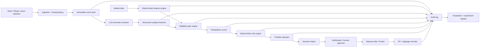

# Arkitektoniskt beslutsunderlag för Vecko_agent v2

**Rollperspektiv:** Senior kvantitativ analys och AI-systemarkitektur  
**Underlag:** `STRATEGI.md` och `Vecko_agent_Kritisk_Granskning_Gemeni.md`  
**Syfte:** Beslutsunderlag inför omstrukturering av kodbas, riskmotor, AI-lager och mätarkitektur  
**Bedömning:** **Omstrukturera före uppskalning. Behåll nuvarande version som fryst baseline/champion.**

---

## Executive summary

Vecko_agent har flera ovanligt bra forskningsmässiga komponenter: separat bokföring per marknad, indexsleeve som alternativkostnad, append-only-beslutslogg, loggning även av avvisade kandidater, explicit redovisning av survivorship bias och en vilja att underkänna egna backtestfynd. Dessa delar bör bevaras.

Det centrala problemet är dock att systemet ännu inte har demonstrerat den enda edge som motiverar den aktiva komplexiteten: **att katalysatorurvalet predicerar benchmark-relativ framtida avkastning efter kostnader**. Samtidigt används denna ännu obevisade signal för både urval och conviction-baserad positionsstorlek. Riskmotorn saknar volatilitetsnormalisering och portföljnivåkontroll, exekveringspriset är inte en förstaklassvariabel i beslutsmotorn, och den kvalitativa kapitalallokeringen mellan Norden och USA är i praktiken ytterligare en okalibrerad modell.

Gemini-granskningen är därför riktad åt rätt håll i fyra frågor: obevisad edge, överfiltrering, LLM-brus och volatilitetsojusterad risk. Däremot är flera slutsatser för kategoriska. Framför allt:

1. **ATR är inte i sig ett “absolut krav”.** Volatilitetsnormalisering är ett krav för en professionell riskmotor; ATR är en möjlig estimator bland flera.
2. **Alla hårda grindar ska inte ersättas av probabilistisk scoring.** Datakvalitet, likviditet och vissa risk-/eventrestriktioner är icke-kompenserbara constraints.
3. **Multi-agent-konsensus löser inte automatiskt LLM-stokasticitet.** Flera agenter kan dela samma bias, vara korrelerade och dessutom öka latensen.
4. **“Latens dödar katalysator-alpha” är för grovt.** Vissa händelser prisas in mycket snabbt, medan andra effekter – exempelvis post-earnings-announcement drift – kan ha längre horisont. Systemet måste därför mäta alpha-decay per katalysatorklass och endast handla signaler vars ekonomiska halveringstid är längre än faktisk beslut-till-fill-latens.
5. **Överfiltreringens effekt är inte visad.** Boolesk AND-logik kan reducera antalet trades kraftigt, men “exponentiellt” förutsätter oberoende filter. Filtren är sannolikt korrelerade. Rätt lösning är en mätbar funnel, inte att reflexmässigt mjuka upp allt.

Den viktigaste arkitektoniska förändringen är att separera systemet i fem tydliga domäner:

> **Data → deterministiska features → AI-baserad semantisk extraktion → statistisk scoring → deterministisk risk/portfölj/exekvering**

LLM-lagret ska inte bestämma RSI, ATR, R/R, positionsstorlek, portföljrisk eller stopnivåer. Det ska extrahera strukturerad information ur ostrukturerad text: katalysatortyp, riktning, materialitet, novelty, evidens, osäkerhet och sannolik tidshorisont. All numerisk risk- och portföljlogik ska vara testbar, versionerad och reproducerbar kod.

Den nuvarande strategin bör därför **inte kasseras**, men den bör omklassificeras från “färdig tradingstrategi” till **instrumenterad forskningsbaseline med begränsat kapital** tills följande tre frågor är besvarade:

- Skapar LLM-/katalysatorurvalet positiv benchmark-relativ edge out-of-sample?
- Ger risknormalisering lägre tail risk och stabilare riskbidrag utan att förstöra edge?
- Är faktisk beslut-till-fill-latens tillräckligt låg i relation till signalens alpha-decay?

---

# DEL 1 — Oberoende analys av STRATEGI.md

## 1. Vad systemet egentligen är

Vecko_agent är bäst beskrivet som en **benchmark + active-overlay-strategi**, inte som en traditionell long-only stock-picking-portfölj.

När en aktiv aktie ersätter en del av indexsleeven består dess ekonomiska bidrag ungefär av:

\[
\text{aktivt bidrag}_i \approx w_i(R_i - R_{index})
\]

och portföljen kan förenklat uttryckas som:

\[
R_p \approx R_{index} + \sum_i w_i(R_i - R_{index}) - C
\]

där \(C\) är kostnader, slippage och eventuell valutafriktionskostnad.

Detta är viktigt eftersom systemets huvudfråga inte bör vara “går portföljen upp?” utan:

> **Ger den aktiva overlayn ett positivt och repeterbart benchmark-relativt bidrag efter kostnader och risk?**

Detta synsätt bör genomsyra loggning, scoring, riskbudget och all utvärdering.

---

## 2. Styrkor som bör bevaras

### 2.1 Indexsleeven är konceptuellt rätt

Att oallokerat kapital går till ett investerbart indexalternativ är metodiskt starkt. Det tvingar varje aktiv position att konkurrera mot en realistisk alternativkostnad. Systemet behöver alltså inte “vinna mot kassa”; det behöver motivera varför aktiv risk tas i stället för indexrisk.

**Behåll.**

### 2.2 Separata böcker per marknad är rätt för alpha-mätning

Norden och USA har olika valuta, kostnader, likviditet, öppettider och benchmark. Att mäta dem var för sig är korrekt.

**Men:** den verkliga investeraren har fortfarande en gemensam balansräkning. Därför behövs även en **konsoliderad riskvy i basvaluta**, även om alpha fortsatt redovisas per bok.

### 2.3 Loggning av avvisade kandidater är en av systemets starkaste komponenter

Det faktum att hela bruttolistan sparas och att även avvisade kandidaters 5- och 20-dagarsutfall mäts skapar ett naturligt kontrafaktiskt dataset. Detta är exakt vad som krävs för att testa om ett filter faktiskt förbättrar selektionen eller bara reducerar trade-frekvensen.

**Behåll och bygg ut.**

### 2.4 Hållregeln angriper en verklig friktion

Strategins egna test pekar på att mekanisk veckorotation genererade onödiga exits och kostnader. Att göra BEHÅLL till default är logiskt för en swingstrategi där tesen kan leva längre än kalenderveckan.

**Behåll som baseline**, men separera effekten av längre innehavstid från effekten av andra samtidiga förändringar i framtida experiment.

### 2.5 Strategin redovisar flera egna metodproblem öppet

Survivorship bias, tidigare felaktig sleeve-hantering, instabila stop/resultat och att den katalysatorbaserade kärnan saknar bevisad alpha anges explicit. Denna transparens är en tillgång för nästa version.

**Behåll denna disciplin i kodbasen genom experimentregister och versionsstyrning.**

---

# 3. Fundamentala brister — prioriterade

## P0. Edge är fortfarande en hypotes, medan risk tas som om den vore en signal

Den mest fundamentala bristen är inte att det mekaniska skelettet underpresterar index. Den mest fundamentala bristen är att **den aktiva beslutskärnan ännu inte har ett validerat mapping från input → framtida benchmark-relativ avkastning**.

Katalysator-, teknik-, R/R- och makrodimensionerna har vikter som är uttryckligen antagna. Samtidigt påverkar poängen både urval och portföljvikt.

Det skapar två lager av osäkerhet:

1. **Signalrisk:** poängen kanske inte predicerar alpha.
2. **Sizing-risk:** en opålitlig poäng får dessutom bestämma hur mycket kapital som riskeras.

Det andra lagret bör tas bort omedelbart. En obevisad signal får inte förstärka sin egen osäkerhet genom conviction sizing.

### Beslut

- Behåll poängen som **forskningsfeature**, inte som primär riskbudget.
- Separera **prediktionsstyrka** från **positionsrisk**.
- Ingen kalibrering bör anses robust enbart för att 15 stängda trades har uppnåtts. Femton observationer kan fungera som en första sanity check men är otillräckligt för stabil kalibrering av flera vikter och interaktioner.

---

## P0. Riskmotorn är inte risknormaliserad

Nuvarande 15–35 % per position är ett kapitalviktsband, inte ett riskband.

Två positioner med 25 % vikt kan ha helt olika:

- ATR/ATR%
- realiserad volatilitet
- gap-risk
- beta
- idiosynkratisk volatilitet
- stopavstånd
- sektor-/faktorexponering
- korrelation med övriga innehav

Att stopnivån ligger 3–5 % från entry och “tekniskt” nära stöd löser inte detta. En teknisk nivå kan vara relevant för tesen men fortfarande ligga innanför normalt prisbrus för en volatil aktie.

### Konsekvens

Portföljens verkliga risktagande bestäms idag mer av vilka tickers som råkar väljas än av en explicit riskbudget.

### Beslut

Inför en separat, deterministisk riskmotor som minst beräknar:

- ATR% eller annan robust kortsiktig volatilitetsestimator
- realiserad volatilitet
- gap-statistik
- planerat stopavstånd
- förväntad loss-at-stop
- beta mot bokindex
- sektor-/faktorkoncentration
- pairwise-korrelation och/eller covariance-estimat
- marginalt riskbidrag till boken

ATR bör användas som **input**, inte som trosartikel. Moreira och Muir (2017) visar bredare att volatilitetsskalning kan förbättra riskjusterade egenskaper, men det bevisar inte att just ATR-stopp är optimala för denna strategi.

---

## P0. LLM-kärnan saknar reproducerbarhetskontrakt

Strategin anger att en språkmodell poängsätter nyheter och tekniska data, men det framgår inte att följande är låsta och loggade för varje beslut:

- modellversion
- systemprompt/version
- temperatur/samplingparametrar
- exakt inputpayload
- exakt källdokument
- publication timestamp
- ingest timestamp
- eventuell uppdatering av artikeln
- output-schema
- token-/truncationstatus
- körnings-ID

Utan detta går det inte att avgöra om en framtida skillnad i resultat beror på marknaden, prompten, modellen, data eller sampling.

### Beslut

LLM-output ska vara ett **versionerat, strukturerat dataprodukt**, inte fri text.

Exempel:

```json
{
  "event_id": "evt_...",
  "ticker": "ABC",
  "catalyst_type": "earnings",
  "event_time_utc": "...",
  "direction": "positive",
  "materiality": 0.74,
  "novelty": 0.81,
  "evidence_strength": 0.88,
  "horizon_class": "slow",
  "thesis_breakers": ["guidance withdrawn"],
  "uncertainty": 0.19,
  "evidence_refs": ["source_span_1", "source_span_2"],
  "model_version": "...",
  "prompt_version": "..."
}
```

LLM:n ska **inte** skriva RSI, ATR, stop, target, R/R eller position weight.

---

## P0. Exekveringslagret mäter beslutskurs men inte nödvändigtvis ekonomisk fill

Strategin loggar verifierad kurs som modellen såg. Detta är inte samma sak som den kurs som användaren faktiskt får.

Minimikrav för varje action:

\[
t_{source}
\rightarrow t_{ingest}
\rightarrow t_{features}
\rightarrow t_{LLM}
\rightarrow t_{decision}
\rightarrow t_{notify}
\rightarrow t_{human\_ack}
\rightarrow t_{order}
\rightarrow t_{fill}
\]

Samt:

- reference price
- intended entry
- order type
- actual fill
- quantity
- spread/slippage-estimat
- realized transaction cost
- eventuell partial fill
- eventuellt utebliven fill

### Varför detta är fundamentalt

Om strategin predicerar +3 % relativ alpha men 1 % försvinner mellan signaltid och faktisk fill är 33 % av signalen borta innan innehavet ens startar. Utan denna mätning kan latens inte diskuteras empiriskt.

---

## P0. Kapitalallokeringen mellan Norden och USA är en egen obevisad modell

Veckoprompten får flytta bokvikter inom 20–80 %, och sleeve-andel används som conviction-indikator.

Detta är mer än administrativ portföljhantering. Det är en **taktisk asset-allocation-signal** som kan påverka portföljutfallet kraftigt.

Problemet är att:

- modellen verkar kvalitativ,
- sleeve-andel är delvis ett resultat av hur hårt filtren slår,
- hög sleeve-andel behöver inte betyda låg framtida alpha,
- låg sleeve-andel behöver inte betyda hög framtida alpha,
- valutarisken saknas ur den redovisade US-avkastningen.

### Beslut

Behandla kapitalallokeraren som en egen challenger-modell. Tills den visat edge bör baseline vara:

- statisk fördelning, eller
- enkel riskbudgeterad fördelning baserad på observerad bokvolatilitet,

men inte LLM-conviction.

---

## P1. Aktiv risk och marknadsrisk blandas ihop

Regimfiltret beskrivs delvis som kapitalförsvar, men när en ny aktie inte öppnas går kapitalet till indexsleeven. Marknadsexponeringen försvinner alltså inte; **idiosynkratisk/aktiv exponering ersätts med benchmarkexponering**.

Det betyder att regimfiltret främst bör utvärderas som:

> “När är den aktiva overlayn värd att ta?”

inte som:

> “När ska portföljen vara risk-on eller risk-off?”

### Ny huvudmetric

Inför:

\[
ActiveReturn_t = R_{portfolio,t} - R_{investable\ sleeve,t}
\]

och mät:

- active Information Ratio
- active drawdown
- active hit rate
- active turnover
- tracking error
- alpha per unit active risk

Detta gör regimfiltret mycket lättare att tolka.

---

## P1. Scoring och gates dubbelräknar delvis samma information

Exempel:

- R/R är både en poängdimension och en hård gate.
- Teknisk setup påverkar poäng och flera tekniska villkor.
- Makromedvind kan överlappa regimfiltret.
- Target reachability, R/R och stopnivå är matematiskt beroende av varandra.

Detta ger en illusion av många oberoende bekräftelser trots att flera features är transformationer av samma underliggande data.

### Beslut

Bygg en **feature dependency map** och skilj på:

1. **Eligibility constraints**
2. **Predictive features**
3. **Risk features**
4. **Portfolio constraints**

Samma variabel ska inte få flera röster utan uttrycklig motivering.

---

## P1. Överfiltrering är ett reellt hot men ännu inte kvantifierat

Det går inte att dra slutsatsen att AND-logiken “nästan eliminerar trades” utan att mäta hur ofta varje filter faller och hur filtren samvarierar.

Filtren är dessutom inte oberoende. Exempelvis kan hög RSI, lång momentumtrend, stort targetavstånd och hög volym vara korrelerade.

### Rätt åtgärd: funnel diagnostics

Logga för varje kandidat:

| Steg | Pass/fail | Förlorade kandidater | 5d alpha | 20d alpha | Kommentar |
|---|---:|---:|---:|---:|---|
| Price verified | | | | | |
| Liquidity | | | | | |
| Regime | | | | | |
| Catalyst recency | | | | | |
| RSI | | | | | |
| Target distance | | | | | |
| R/R | | | | | |
| Event blackout | | | | | |
| Promotion cap | | | | | |

För varje gate ska systemet kunna besvara:

> “Vilken benchmark-relativ framtida avkastning hade de kandidater som föll här?”

Om avvisade kandidater systematiskt är bättre än de accepterade är gaten felkalibrerad.

---

## P1. Target-reachability-formeln är modellantagande, inte risklag

Formeln med ungefärlig \(\sqrt{T}\)-skalning är rimlig som grov sanity check men den antar en volatilitetsskalning som inte nödvändigtvis gäller runt katalysatorhändelser, gap eller autokorrelation.

### Beslut

Ersätt på sikt ett generellt “nåbarhetstak” med empiriska distributionsmått per:

- volatilitet
- katalysatortyp
- likviditetsklass
- horisont

Exempel: historisk 70-/80-percentil av absolut benchmark-relativ rörelse över aktuell horisont.

---

## P1. Planned stop är inte samma sak som realized stop risk

En manuell stopdisciplin kan inte garantera fill vid stopnivån. Gap mellan stängning och öppning kan göra en planerad 4 %-risk till betydligt större faktisk förlust.

### Beslut

Riskmotorn behöver en **effective stop risk**:

\[
s_{eff} = f(s_{planned}, ATR\%, gap\_distribution, liquidity)
\]

Positionsstorlek ska baseras på konservativ effektiv risk, inte enbart grafiskt stopavstånd.

---

## P1. Statistiska trösklar är för låga för inferens

“Minst 8 mätpunkter” kan vara rimligt som gräns för att börja visa en deskriptiv siffra. Det är inte en rimlig gräns för att påstå edge.

På samma sätt är 15 stängda affärer för lite för robust optimering av flera vikter, särskilt när:

- utfallen är brusiga,
- features är korrelerade,
- många parametrar och regler redan har testats,
- marknadsregim ändras,
- holdingperioder överlappar.

Backtest mining och multipel testning är välkända problem i strategiutveckling; enkla hold-out-splitar ger inte alltid ett tillräckligt skydd när många modeller och parametrar har prövats (Bailey et al., 2017; Harvey et al., 2016).

### Beslut

Inför ett experimentregister med:

- hypotes
- exakt parameterändring
- primär metric
- sekundära metrics
- datasetversion
- antal tidigare försök i samma hypotesfamilj
- train/validation/OOS-period
- godkännandekriterium före körning
- resultat
- beslut
- versions-ID

Weekly retro får **skapa hypoteser**, men ska inte automatiskt få ändra produktionsregler.

---

## P1. Benchmark- och total-return-definition måste auditeras

Strategin anger `SPY` som sleeve och `^GSPC` som benchmark. Det framgår inte av dokumentet om jämförelsen använder prisindex, adjusted close, utdelningar och fondkostnad konsistent.

Detta är en potentiellt materiell mätfråga.

### Beslut

För performance accounting:

- jämför aktiv bok mot **det investerbara sleeve-alternativets total return**,
- inkludera utdelningar,
- inkludera faktisk ETF-kostnad där relevant,
- behåll eventuell separat akademisk indexjämförelse som sekundär metric,
- redovisa US-boken både i USD och den totala portföljen i investerarens basvaluta.

---

## P2. Dokumentets tidsmetadata är inkonsistent

Dokumentversionen är 2026-08-08 samtidigt som statusraden säger “skarp drift med riktiga pengar sedan 2026-08-10”, medan senare avsnitt säger att skarp start sker 2026-08-10.

Detta påverkar inte edge, men är en signal om att metadata och experimentstatus behöver genereras automatiskt i stället för att skrivas manuellt.

---

# 4. Exekveringslatens — mer exakt analys

Gemini har rätt om att latens kan förstöra event-driven alpha, men alla katalysatorer har inte samma decay.

## 4.1 Dela katalysatorer efter hastighet

### Fast alpha

Exempel:

- M&A-rykten
- vissa regulatoriska besked
- abrupt guidance/vinstvarning
- binära beslut
- takeover-premier

Dessa kan få huvuddelen av prisreaktionen mycket snabbt.

### Medium alpha

Exempel:

- ordernyheter
- kapitalallokering/buybacks
- förändrad guidance där marknaden behöver tolka konsekvenser
- vissa indexhändelser

### Slow alpha

Exempel:

- post-earnings drift
- successiv analytikerrevidering
- långsammare informationsdiffusion

PEAD är väldokumenterat historiskt som ett fenomen där reaktionen kan fortsätta efter själva rapportdagen, även om ekonomisk styrka och implementerbarhet varierar över tid och universum (Bernard & Thomas, 1989, 1990).

## 4.2 Arkitekturprincip

**Signalens tillåtna exekveringslatens ska vara en funktion av signalens empiriska alpha-decay.**

Definiera:

\[
L = t_{fill} - t_{source}
\]

och mät därefter exempelvis benchmark-relativ prisrörelse vid:

- source → decision
- decision → notification
- notification → order
- order → fill
- fill → +1d
- fill → +5d
- fill → +20d

En katalysatorklass ska inte handlas om huvuddelen av dess historiska edge konsumeras före systemets typiska fill.

Det är mycket bättre än att försöka “göra hela systemet snabbare” utan att veta vilken latency budget signalen faktiskt kräver.

---

# DEL 2 — Utvärdering av Gemini-granskningen

## 5. Övergripande bedömning av granskningen

Gemini identifierar flera centrala problem, men texten är skriven med ett på förhand bestämt mål: att “bevisa” att systemet kommer att misslyckas. Det är metodiskt problematiskt. En kritisk review ska försöka falsifiera strategin, men inte anta sin slutsats.

Flera formuleringar — exempelvis “garanterar”, “absolut krav” och att alpha “med största sannolikhet helt [är] borta” — går längre än det presenterade underlaget.

Min bedömning är därför:

> **Diagnosen är i stora drag användbar. Bevisstyrkan och vissa föreslagna lösningar är svagare än retoriken antyder.**

---

## 6. Punkt-för-punkt

| Gemini-punkt | Bedömning | Vad som är rätt | Vad som behöver nyanseras |
|---|---|---|---|
| Kärnan saknar bevisad edge | **Håller med starkt** | Katalysatorurvalet är ännu inte validerat. | Att bygga mätinfrastruktur före bevisad edge är inte ett metodfel i sig. Problemet uppstår om systemet tar betydande kapitalrisk innan hypotesen validerats. |
| Överfiltrering / AND-logik | **Håller med om risken** | Många sequential constraints kan sänka trade-rate och missa vinnare. | “Exponentiellt” kräver ungefär oberoende filter. Här är flera filter korrelerade. Mät funneln innan gates mjukas upp. |
| LLM är icke-deterministisk | **Håller med starkt** | Samma input kan ge olika semantisk bedömning och därmed beslut. | Multi-agent-konsensus är inte en fullgod lösning. Agenter kan vara korrelerade och konsensus kan öka latency. |
| ATR/risk | **Håller med om diagnosen** | Position sizing är volatility-agnostic och conviction styr risk. | Stoppen är inte exakt “samma mekaniska 3 %”; de sätts tekniskt inom 3–5 %. ATR är inte den enda korrekta volatilitetsmodellen. |
| Latens | **Håller delvis med** | Fast event-alpha kan försvinna före manuell fill. | Alla katalysatorer är inte HFT-signaler. PEAD och andra långsammare effekter motbevisar den generella formuleringen. Mät decay per signaltyp. |
| Probabilistisk scoring ska ersätta AND-logik | **Delvis** | Ranking bör bli mer probabilistisk. | Datakvalitet, likviditet och vissa risk-/eventrestriktioner ska vara hårda gates. |
| Multi-agent system | **Inte som primär lösning** | Oberoende kritik kan ge uncertainty-signal. | “Flera LLM:er” skapar inte automatiskt oberoende, kalibrering eller determinism. Kör parallellt och låt deterministic code aggregera. |
| Automatisk matematik i Python | **Håller med fullt** | Teknisk matematik, risk och portföljlogik ska vara reproducerbar kod. | Utvidga detta till benchmark accounting, latency, slippage, portfolio risk och experimentstatistik. |

---

## 7. Viktiga saker Gemini missar

### 7.1 Kapitalallokeraren mellan böckerna

Detta är den största missen i reviewn. En 20–80 %-allokering som styrs kvalitativt kan få större effekt på totalportföljen än enskilda aktieval.

### 7.2 Active-overlay-perspektivet

Eftersom sleeven alltid bär oallokerat kapital bör edge mätas som **active return vs investerbar sleeve**, inte bara som bokavkastning.

### 7.3 Execution-price accounting

Reviewn pratar om latens men kräver inte ett explicit fill-/slippage-schema. Utan det går latensproblemet inte att mäta.

### 7.4 Benchmark total return

`SPY` och `^GSPC` är inte automatiskt ekonomiskt identiska benchmarkserier. Utdelningar, ETF-friktion och adjusted/unadjusted data måste auditeras.

### 7.5 Portföljkorrelation och faktor-/sektorbeta

Fyra aktier kan vara “fyra tickers” men ekonomiskt en enda faktorposition. Strategin säger detta kvalitativt men mäter det inte.

### 7.6 Adaptive-overfitting från retrospektiv lärdom

Veckoretro är bra för hypotesgenerering men farlig om lärdomar kontinuerligt skriver nya regler i produktion. Det skapar en mänsklig/LLM-baserad variant av repeated backtest mining.

### 7.7 Gap-risk och stop execution

En stopnivå är inte en garanti för realiserad exitkurs, särskilt för eventdrivna aktier.

### 7.8 Konflikten mellan multi-agent och latency

Gemini föreslår fler LLM-agenter samtidigt som granskningen pekar ut latency som ett huvudproblem. Ett iterativt agentmöte i fast-alpha-pathen går i fel riktning.

---

# DEL 3 — Syntes och åtgärdsplan

# 8. Arkitekturprinciper för Vecko_agent v2

## Princip 1 — Separera constraints, prediction och risk

Detta är den viktigaste designprincipen.

### Hårda eligibility constraints

Exempel på sådant som inte ska kunna “kompenseras” av hög score:

- verifierad och tillräckligt färsk kurs
- minimilikviditet
- dataintegritet
- förbjuden eventperiod enligt aktuell produktionspolicy
- maxportfölj-/positionsrisk
- stopdisciplin
- system-/datafel

### Predictive features

Exempel:

- katalysatormaterialitet
- novelty
- historisk momentum
- teknisk trend
- volume surprise
- macro context
- event age
- analyst revision context
- RSI som kontinuerlig feature i stället för nödvändigtvis binär pass/fail

### Risk features

Exempel:

- ATR%
- realized vol
- gap quantiles
- beta
- correlation
- stop distance
- liquidity/spread
- concentration

### Portfolio constraints

Exempel:

- max vikt
- max sektor/faktor
- max marginal risk contribution
- max tracking error
- max total active risk

---

# 9. Föreslagen systemarkitektur



---

# 10. LLM-lagret: vad AI ska och inte ska göra

## AI ska göra

- läsa text
- identifiera vilken händelse som faktiskt inträffat
- skilja ny information från återpublicerad information
- klassificera katalysatortyp
- estimera materialitet
- identifiera positiv/negativ riktning
- extrahera explicit evidens
- identifiera thesis breakers
- bedöma informationsosäkerhet
- klassificera ungefärlig speed/horizon

## AI ska inte göra

- hämta eller “gissa” kurs
- räkna RSI/MACD/EMA
- räkna ATR
- räkna R/R
- bestämma position weight direkt
- summera portföljrisk
- avgöra orderstorlek
- flytta stops
- utföra benchmark accounting
- göra aritmetik som går att skriva deterministiskt

---

# 11. Multi-agent-design: använd som uncertainty estimator, inte sanningsmaskin

Om flera AI-agenter används ska de **inte** föra en lång fri diskussion tills de “kommer överens”.

Bättre design:

1. Samma immutable input till flera parallella roller.
2. Varje agent måste returnera samma JSON-schema.
3. Agenterna får inte se varandras svar.
4. En deterministisk aggregator jämför:
   - direction
   - catalyst type
   - materiality
   - evidence refs
   - horizon
5. Disagreement blir en mätbar feature.
6. Hög disagreement kan:
   - sänka score,
   - kräva human review,
   - eller stoppa en fast-path-signal.

### Rekommenderade roller

- **Extractor:** Vad hände objektivt?
- **Analyst:** Varför kan detta påverka framtida kassaflöde/positionering?
- **Adversarial reviewer:** Vilken alternativ tolkning gör signalen falsk?

Risk manager bör **inte** vara en LLM-agent. Risk ska vara kod.

### Latencyregel

Multi-agent får främst användas i **slow lane**. Fast lane ska använda en enda strikt extractor eller ingen LLM alls om händelsen kan klassificeras deterministiskt.

---

# 12. Probabilistisk scoring — målbild

Nuvarande 1–10-vikter bör på sikt ersättas av en modell vars output har ekonomisk betydelse.

Exempel på labels:

\[
y_{5} = R_{stock,5d} - R_{benchmark,5d} - cost
\]

\[
y_{20} = R_{stock,20d} - R_{benchmark,20d} - cost
\]

Modellen kan estimera:

- \(P(y_{5} > 0)\)
- \(P(y_{20} > 0)\)
- \(E[y_{20}]\)
- downside-quantil, exempelvis \(Q_{10}(y_{20})\)

Därefter kan ranking bygga på exempelvis:

\[
Utility_i = E[\alpha_i] - \lambda \cdot Downside_i - Cost_i
\]

Det är bättre än “8,2/10” eftersom enheten är kopplad till framtida avkastning och risk.

## Viktigt: inför detta i shadow mode först

Det nuvarande datamaterialet är för litet för att omedelbart träna en komplex modell.

Första versionen bör därför:

1. fortsätta logga nuvarande score,
2. skapa strukturerade AI-features,
3. samla 5d/20d benchmark-relative labels,
4. utvärdera calibration/ranking out-of-sample,
5. först därefter låta sannolikhetsmodellen påverka live-urval.

---

# 13. Riskmotor — rekommenderad teknisk riktning

## 13.1 Separera stop location från position risk

Stoppen kan uttrycka när tesen är invaliderad. Positionsstorleken ska uttrycka hur mycket kapital portföljen får förlora om tesen är fel.

De är två olika problem.

En enkel grundmodell är:

\[
w_i \leq \frac{B_i}{s_{eff,i}}
\]

där:

- \(w_i\) = position weight
- \(B_i\) = tillåten equity-risk för positionen
- \(s_{eff,i}\) = konservativ effektiv stoprisk i procent

Därutöver gäller maxvikter och portföljconstraints.

## 13.2 Två separata ATR-experiment

### Experiment A — volatility-aware sizing, oförändrad stoplogik

Behåll nuvarande tekniska stop inom 3–5 %, men minska position weight när:

- ATR% är hög,
- gap-risk är hög,
- likviditet är svag.

Detta isolerar effekten av sizing.

### Experiment B — volatility-aware stop + sizing

Testa därefter en separat challenger där teknisk stop måste ligga utanför en definierad volatilitetsbuffert, exempelvis ett multipelintervall av ATR, och positionen minskas så att equity-risk inte ökar.

Det är metodiskt bättre än att ändra både stop och weight samtidigt i första testet.

---

# 14. Portföljrisk som saknas idag

Följande ska beräknas före varje nytt köp:

- projected portfolio volatility
- active beta
- tracking error
- marginal contribution to risk
- sector concentration
- factor concentration
- correlation cluster
- expected loss at stops
- gap stress loss

## Exempel på reject-logik

Ett case kan ha hög förväntad alpha men ändå avslås om:

- det gör portföljen för beroende av samma sektor/faktor,
- marginal risk contribution blir för hög,
- den totala loss-at-stop-budgeten överskrids.

Detta är en legitim hard gate. En hög katalysatorscore ska inte kunna “köpa sig fri” från portföljrisk.

---

# 15. Latensarkitektur

## 15.1 Mät först

Inför latency telemetry för samtliga steg.

Primära mått:

- p50/p90/p95 ingest → decision
- p50/p90/p95 decision → notification
- p50/p90/p95 notification → order
- p50/p90/p95 order → fill
- total source → fill

## 15.2 Två pipelines

### Fast lane

För eventtyper med snabb decay:

- event-driven ingest
- precomputed technical features
- minimal LLM-pass
- deterministic gates
- deterministic risk
- omedelbar notification med färdig orderticket
- expiry om latency-SLA bryts

### Slow lane

För långsammare swingcase:

- djupare textanalys
- flera AI-perspektiv
- mer fullständig rapport
- veckovis portfolio review

## 15.3 Viktig princip

Om den mänskliga exekveringen typiskt tar längre tid än signalens observerade alpha-horizon ska systemet **inte försöka kompensera med mer AI**.

Då finns bara tre rationella alternativ:

1. sluta handla den katalysatorklassen,
2. automatisera mer av orderberedningen,
3. ändra signalen till en långsammare variant.

---

# 16. Automatiserat workflow utan att ge LLM ordermakt

Rekommenderad sekvens:

```text
1. Event arrives
2. Validate source + timestamp
3. Join cached market features
4. AI extracts structured catalyst features
5. Deterministic eligibility checks
6. Statistical scorer estimates alpha/probability
7. Deterministic risk engine sizes position
8. Portfolio constraints checked
9. Immutable decision object created
10. Human receives one actionable notification
11. Human approves/rejects
12. Actual fill captured
13. Outcome automatically evaluated at 5d/20d and exit
```

Detta kan reducera timmar av manuellt informationsarbete utan att ge språkmodellen direkt kontroll över pengar.

---

# 17. Statistisk validering — ny standard

## 17.1 Baseline måste frysas

Nuvarande strategi blir **Champion v1**.

Ingen retro eller promptförändring får skriva över historiken. Varje ny regel blir en ny challenger-version.

## 17.2 Walk-forward före “bästa cell”

Använd tidsordnade train/validation/test-fönster och undvik slumpmässig cross-validation för överlappande finansdata.

Vid överlappande 20-dagarslabels bör split-designen ha purge/embargo så att närliggande observationer inte läcker information.

## 17.3 Multipel testning ska loggas

Varje parameterfamilj måste ha ett testregister. Ju fler RSI-gränser, ATR-multiplar, holdingperioder, scorevikter och regimfilter som provas, desto högre blir risken att bästa resultatet är ett urvalsartefakt. Bailey et al. (2017) och Harvey et al. (2016) visar varför repeated strategy mining kräver hårdare validering än att bara välja den historiskt bästa parametern.

## 17.4 Confidence intervals, inte bara punktestimat

Rapportera minst:

- mean/median active alpha
- bootstrap confidence interval
- hit rate
- downside quantiles
- max drawdown
- Information Ratio
- turnover
- number of independent-ish events

“8 observationer” bör markeras som **deskriptivt underlag**, inte statistisk evidens.

## 17.5 Candidate-level data är viktigare än closed-trade count för signalforskning

Systemet får 10–15 kandidatbeslut per vecka men få stängda trades. Därför är det klokt att använda alla observerade kandidatutfall för att testa ranking/selection.

Det innebär dock inte att position sizing eller exitlogik kan kalibreras från samma dataset utan separat analys.

---

# 18. Falsifierbara experiment före större omskrivning av reglerna

Nedan är rekommenderade **ex ante** acceptanskriterier. De är designmål, inte påståenden om vad historiken redan visar.

## Test 1 — Volatilitetsjusterad positionsstorlek

**Ändring:** Ersätt conviction-baserad sizing med riskbudgeterad sizing, medan entry/exit hålls oförändrade.

**Test:** Replay exakt samma historiska beslut i walk-forward.

**Primär hypotes:** risknormalisering minskar drawdown/tail-risk utan materiell försämring av active return.

**Rekommenderat godkännande:**

- lägre max active drawdown i båda böckerna,
- lägre 95-percentil av enskild positionsförlust,
- active Information Ratio får inte försämras materiellt,
- inga högre koncentrationsmått.

**Om fel:** behåll nuvarande sizing som baseline och testa annan volatilitet/risk-estimator.

---

## Test 2 — ATR/volatility-aware stop

**Ändring:** Stop får ligga utanför nuvarande band när normal volatilitet kräver det; weight minskas så att equity-risk hålls konstant.

**Test:** Matchade kandidat-/entry-observationer, samma signal, endast exit/sizing ändras.

**Primär hypotes:** färre noise-stopouts följda av snabb återhämtning utan större tail losses.

**Mät:**

- stop-out frequency
- andel stopouts som därefter når target inom ordinarie horisont
- realized R
- drawdown
- active return efter kostnad

**Om fel:** ATR används endast för sizing, inte stopplacering.

---

## Test 3 — Probabilistisk scoring

**Ändring:** LLM:s 1–10 totalpoäng blir challenger; strukturerade features används för att predicera 5d/20d active return.

**Test:** Strict walk-forward/shadow.

**Godkännande kräver:**

- bättre out-of-sample ranking än nuvarande score,
- positiv net active alpha i högsta scoregruppen,
- calibration som är bättre än base-rate-modell,
- resultatet får inte bero på en enda marknadsperiod.

**Om fel:** behåll heuristisk ranking men fortsätt samla strukturerade labels.

---

## Test 4 — Gate ablation

**Ändring:** Ingen live-gate tas bort direkt. Varje gate testas kontrafaktiskt.

**Test:** Jämför framtida active return för kandidater som:
- passerade allt,
- endast föll på gate X,
- föll tidigare i funneln.

**Godkännande för att mjuka upp gate:** “gate X only”-gruppen måste visa konsekvent positiv incremental alpha och acceptabel risk i OOS-data.

**Om fel:** gaten behålls.

---

## Test 5 — Regimfilter som active-overlay-filter

**Ändring:** Utvärdera MA200 på aktiv overlay snarare än total bokavkastning.

**Test:** Samma sleeve, samma kandidater; jämför incremental active return när regime ON/OFF.

**Hypotes:** regimfiltret bör primärt förbättra active Information Ratio, inte bara total marknadsavkastning.

**Om fel:** behåll inte regeln enbart för att den råkar förbättra total bokkurva.

---

## Test 6 — Kapitalallokering Norden/USA

**Challengers:**

1. statisk 50/50,
2. volatility-balanced,
3. nuvarande LLM-allokerare.

**Test:** walk-forward på faktiskt bokutfall efter kostnader.

**Godkännande:** LLM-allokeraren måste förbättra total portfolio Information Ratio och/eller drawdown robust, inte bara total return.

**Om fel:** använd statisk eller riskbaserad allokering.

---

## Test 7 — Latency / alpha-decay

**Ändring:** Ingen strategiändring initialt; endast telemetry.

**Test:** För varje katalysatortyp, estimera hur benchmark-relativ rörelse utvecklas från source time till faktisk fill.

**Mät:**

\[
AlphaLeakage = \frac{\text{rörelse source→fill i signalriktningen}}{\text{förväntad total rörelse}}
\]

**Beslut:** en fast-alpha-katalysator får endast vara live om edge efter faktisk fill fortfarande är positiv efter kostnader.

**Om fel:** katalysatortypen flyttas till “research only” eller kräver snabbare workflow.

---

## Test 8 — LLM-reproducerbarhet

**Ändring:** Kör samma immutable input flera gånger över modeller/promptversioner i shadow.

**Mät:**

- agreement på catalyst type
- direction agreement
- materiality dispersion
- score/rank stability
- latency
- evidence consistency

**Godkännande:** produktionsmodellen ska uppvisa stabil klassificering och låg beslutskänslighet för sampling. Hög disagreement ska explicit öka uncertainty.

**Om fel:** förenkla LLM-uppgiften och flytta mer logik till deterministisk kod.

---

# 19. Förväntad effekt av omstruktureringen

Ingen av nedanstående effekter är garanterad alpha. De är mekaniska eller sannolika systemeffekter som förbättrar möjligheten att skapa och mäta riskjusterad edge.

| Förändring | Direkt effekt | Förväntad risk-/avkastningseffekt |
|---|---|---|
| Volatility-aware sizing | Jämnare risk per position | Lägre tail-risk och mindre beroende av enskilda volatila case |
| Portfolio covariance/risk caps | Hindrar dold klusterrisk | Lägre koncentrationsdrawdowns |
| Structured LLM extraction | Mindre fri-text-brus | Högre reproducerbarhet och bättre dataset |
| Deterministisk feature/risk engine | Samma input → samma matematik | Färre operativa fel och enklare backtest/live-paritet |
| Probabilistisk scoring | Score kopplas till observerad outcome | Bättre kalibrerbar ranking om signalen faktiskt har edge |
| Gate funnel + ablation | Visar exakt vad varje filter kostar | Minskad risk för både över- och underfiltrering |
| Event-driven fast lane | Kortare machine latency | Mindre alpha leakage i snabba signaler |
| Fill/slippage logging | Ekonomiskt korrekt entry | Realistisk netto-alpha och R/R |
| Active-overlay accounting | Isolerar stock-picking-bidraget | Tydligare beslut om strategin bör slå på/av aktiv risk |
| Experiment registry | Stoppar odisciplinerad parameterjakt | Lägre risk för backtest overfitting |
| Shadow/champion-challenger | Ändringar testas utan att skriva om historien | Högre forskningsvaliditet |
| Riskbaserad book allocation | Separat kontroll av Norden/USA-risk | Mindre risk att en okalibrerad LLM-allokerare dominerar resultatet |

---

# 20. Prioriterad genomförandeordning

## Fas 0 — Frys och instrumentera

Gör detta innan strategilogiken ändras:

1. Frys `Champion v1`.
2. Lägg versions-ID på varje prompt, modell och konfiguration.
3. Logga source/decision/order/fill timestamps.
4. Logga actual fill och slippage.
5. Auditer benchmark/total-return-data.
6. Skapa active-overlay-metrics.
7. Stoppa automatisk regelmutation från retrospektiv text.

**Mål:** göra dagens system mätbart innan det förbättras.

---

## Fas 1 — Bygg deterministisk kärna

Flytta all matematik till kod:

- prices
- corporate-action adjustment
- RSI/MACD/EMA
- ATR/realized vol
- R/R
- liquidity
- target reachability
- costs
- beta/correlation
- portfolio risk
- sizing
- benchmark accounting

**Mål:** en och samma datapunkt ska ge samma numeriska resultat oavsett vilken LLM som används.

---

## Fas 2 — Separera AI från beslut

LLM producerar endast strukturerade catalyst features med evidens.

Inför:
- schema validation,
- confidence/disagreement,
- model/prompt versioning,
- evidence spans,
- immutable input snapshots.

**Mål:** AI blir en feature generator, inte en portföljförvaltare.

---

## Fas 3 — Ny riskmotor

1. Testa volatility-aware sizing med oförändrade stops.
2. Lägg portföljrisk/correlation caps.
3. Testa därefter ATR-/volatility-aware stop som separat experiment.
4. Sluta låta conviction-score direkt sätta position weight.

**Mål:** samma ekonomiska tes ska inte innebära helt olika kapitalrisk beroende på ticker-volatilitet.

---

## Fas 4 — Probabilistisk scorer i shadow mode

Träna först när datan räcker.

Outputs:
- probability of positive 5d/20d active return,
- expected active return,
- downside estimate,
- uncertainty.

**Mål:** ersätta semantiska “poäng” med mätbara prognoser.

---

## Fas 5 — Latency-aware routing

Klassificera varje katalysator i fast/medium/slow.

- Fast → minimal pipeline och strikt expiry.
- Slow → djupare analys tillåts.
- Signal som inte överlever human latency → inte tradable i nuvarande operativa modell.

**Mål:** systemet ska inte jaga alpha vars ekonomiska halveringstid är kortare än dess egen process.

---

## Fas 6 — Challenger för book allocation

Jämför statisk, riskbaserad och LLM-baserad allokering.

**Mål:** bevisa att översta kapitalallokeringslagret tillför något innan det får flytta stora vikter.

---

# 21. Vad som bör behållas oförändrat tills nytt test finns

Följande bör inte ändras impulsivt under refaktorn:

- verifierad kurs med källa och timestamp
- append-only-beslutslogg
- loggning av avvisade kandidater
- separata alpha-böcker/benchmarks
- stopdisciplin
- nuvarande rapportförbud som baseline
- hold-regeln som baseline
- MA200-regimfiltret som champion-regel tills active-overlay-testet är genomfört
- transaktionskostnader netto i utvärdering

Det är viktigt att arkitekturrefaktor inte blandas ihop med parameteroptimering. Först ska systemet göras reproducerbart och mätbart. Därefter ändras regler en i taget.

---

# 22. Vad som bör ändras först

Om endast fem ändringar får göras före nästa iteration:

1. **Inför actual-fill + latency telemetry.**
2. **Ta bort conviction-baserad positionsstorlek och inför risknormaliserad sizing som challenger.**
3. **Flytta all matematik från LLM till deterministisk feature/risk engine.**
4. **Mät strategy edge som active overlay mot investerbar sleeve.**
5. **Gör LLM till strukturerad catalyst extractor med modell-/promptversionering.**

Probabilistisk scoring kommer därefter. Att bygga en avancerad scorer innan datan, labels, fills och riskmotor är korrekta riskerar bara att statistiskt förfina fel målvariabel.

---

# 23. Rekommenderat arkitekturbeslut

## Beslut A — Ja till omstrukturering

**Motivering:** Nuvarande kod blandar forskningshypotes, semantisk AI-bedömning, riskbeslut och operativ exekvering för nära. Det gör det svårt att veta var alpha eller fel faktiskt uppstår.

## Beslut B — Ja till volatilitetsjustering

**Men:** börja med positionsstorlek. Testa ATR-stopp separat. ATR är en estimator, inte en dogm.

## Beslut C — Ja till probabilistisk scoring

**Men:** endast som shadow/challenger tills tillräcklig OOS-data finns. Nuvarande score får inte bara bytas mot en mer komplex svart låda.

## Beslut D — Ja till automatiserade workflows

**Motivering:** Det reducerar manuell informationslatens och skapar mätbara timestamps.

**Begränsning:** automation av databehandling och orderberedning är inte samma sak som automatisk orderexekvering. Människan kan fortsatt vara sista kontrollpunkt.

## Beslut E — Delvis ja till multi-agent

**Användning:** semantic uncertainty och adversarial review.

**Inte:** riskmatematik, slutlig sizing eller lång agentdebatt i latency-kritiska event.

---

# 24. Slutlig bedömning

Vecko_agent har inte i nuläget bevisat att den aktiva kärnan skapar alpha. Det betyder inte att projektet saknar värde; det betyder att **nästa koditeration ska vara byggd för att avgöra frågan snabbt och korrekt, inte för att göra den befintliga hypotesen mer sofistikerad**.

Den mest rationella målbilden är därför:

> **Ett deterministiskt, benchmark-relativt och risknormaliserat trading-system där AI endast omvandlar ostrukturerad information till versionerade features, medan statistik avgör om features har prediktiv kraft och strikt kod avgör om och hur mycket kapital som får riskeras.**

Om denna arkitektur implementeras får systemet fyra egenskaper som dagens version saknar fullt ut:

1. **Reproducerbarhet** — samma data ger samma matematik och audit trail.
2. **Riskkonsistens** — positioner dimensioneras efter faktisk risk, inte språklig conviction.
3. **Mätbar latency** — alpha leakage kan kvantifieras och katalysatortyper kan stängas av om processen är för långsam.
4. **Falsifierbar edge** — systemet kan faktiskt visa om katalysatorurvalet skapar benchmark-relativ överavkastning efter kostnad.

Det är den ordning som bör styra omskrivningen av kodbasen.

---

# Referenser

Bailey, D. H., Borwein, J. M., López de Prado, M., & Zhu, Q. J. (2017). The probability of backtest overfitting. *Journal of Computational Finance, 20*(4), 39–69. https://doi.org/10.21314/JCF.2016.322

Bernard, V. L., & Thomas, J. K. (1989). Post-earnings-announcement drift: Delayed price response or risk premium? *Journal of Accounting Research, 27*, 1–36. https://doi.org/10.2307/2491062

Bernard, V. L., & Thomas, J. K. (1990). Evidence that stock prices do not fully reflect the implications of current earnings for future earnings. *Journal of Accounting and Economics, 13*(4), 305–340. https://doi.org/10.1016/0165-4101(90)90008-R

Harvey, C. R., Liu, Y., & Zhu, H. (2016). …and the cross-section of expected returns. *The Review of Financial Studies, 29*(1), 5–68. https://doi.org/10.1093/rfs/hhv059

Moreira, A., & Muir, T. (2017). Volatility-managed portfolios. *The Journal of Finance, 72*(4), 1611–1644. https://doi.org/10.1111/jofi.12513

Wilder, J. W., Jr. (1978). *New concepts in technical trading systems*. Trend Research.

---

## Internt underlag

- `STRATEGI.md`, version 2026-08-08.
- `Vecko_agent_Kritisk_Granskning_Gemeni.md`.
